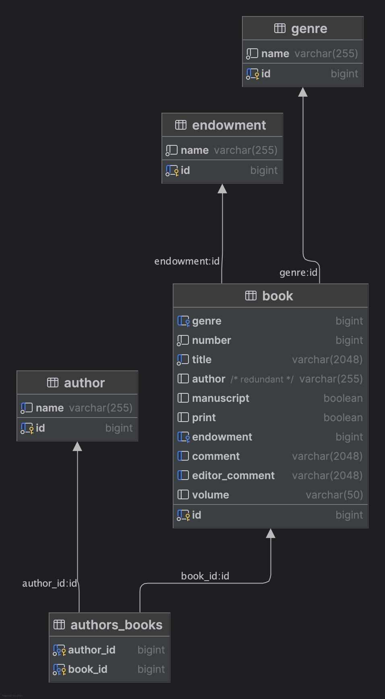

# Damascus 1882 Public Library Catalogue

This project is a combination of two things:

1. Connect my studies in the humanities at [Freie Universität Berlin](https://www.fu-berlin.de/) with my current career as a web developer.
2. Try out new things and tech stacks that I so far didn't have a project for.

## University background

I majored in Islamic Studies (MA) in 2018. Part of my MA thesis was an analysis of a library catalogue 
that was created in Damascus in 1882. Back then, all previously independent collections of endowed books and manuscripts 
were collected and put together into a newly established public library, 
which later became the Syrian National Library after independence.

The catalogue for this new library was a printed book detailing every single item and its provenance 
and therefore very interesting for the study of the history of reading and scholarly life.

Back in 2018 I compiled this (manually) into a LibreOffice Base database (having no clue about databases I 
used a single table) and used it for my research.

## Who this project is for

First and foremost: myself, to have a small, but not trivial project with a clear scale and focus to go wild on useless implementation details. Call it bike-shedding-driven development.

I do intend to publish/host the whole thing and make the data available with searching/filtering so it could actually be used by researchers interested in the data, but if there are any of those left at least seven years after my measly MA thesis I cannot say.

## Technical Background

I plan to do the purest form of serious overengineering at its finest. Technologies I have never used and always wanted to try out:

- Different server-side frameworks in the Java/Kotlin, Swift, C#, and Go ecosystems
- distributed deployments with Docker/Kubernetes
- debloated frontends with a clear focus on web standards
- Spec-driven development with a focus on OpenAPI

⇒ all of those are going to be used here.

## Project Outline

I have identified several main guiding project principles:

1. The database is the source of truth for all other parts. It is a historical source and as such will never change 
its basic content (adding additional information by researchers is fine, but there should never be more rows).
2. The database is pre-configured, all backend frameworks must not use ORMs or other tools modifying it.
3. Deployment is done with Docker (and Kubernetes if I feel really adventurous).
4. There is only one database in the deployment.
5. Backend services all follow the same OpenAPI specification to expose the data to the outside via a REST API.
6. A reverse proxy is used in the deployment setup to route requests to a random backend service, 
making each of them completely stateless and interchangeable.
7. The frontend is a fully static website bundled with [Vite](https://vite.dev/) using [Lit](https://lit.dev/) web components.
I chose Lit because it only provides a very thin layer on top of the Web Components standard.
It contains routes to query and filter the data with client-side fetch requests as well as static pages with background information.
8. The REST API is freely available for anyone to use.

### Backend frameworks

#### Started
- [x] Kotlin with [Ktor](https://ktor.io/)
- [ ] Go with [OpenAPI-codegen](https://github.com/oapi-codegen/oapi-codegen)

#### Planned
- [ ] Java with [Quarkus](https://quarkus.io/)
- [ ] Swift with [Vapor](https://vapor.codes/)
- [ ] C# with [ASP.NET Core](https://dotnet.microsoft.com/en-us/apps/aspnet)

#### Spec-Complete
- none so far

## Database documentation

For this project the original database has been converted into a proper PostgreSQL database, data has been normalized and
split into separate tables and indexes, and proper foreign keys have been added.

### Tables

- book
- author
- authors_books (many-to-many)
- endowment
- genre

## Local development

- TODO: write something here

## Deployment

Currently, the project is in a very early stage and is not yet deployed anywhere.

